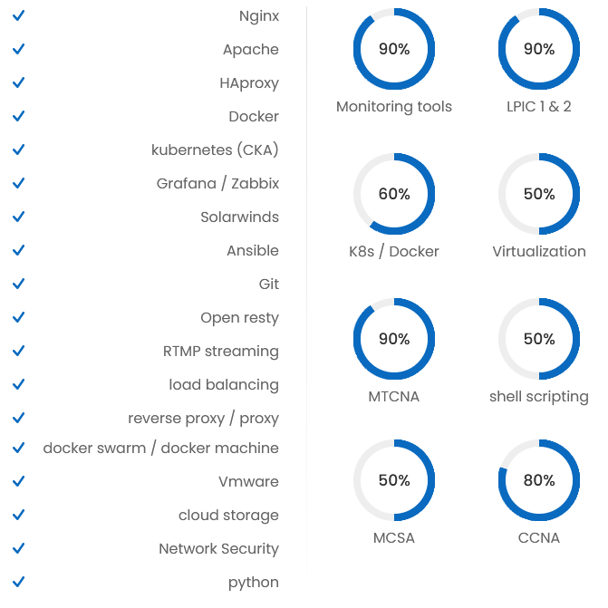

<h2> 👀 I’m interested in open source & network </h2>
<h4>🌱 I’m currently learning linux </h4>

<!--- 
m-taghva/m-taghva is a ✨ special ✨ repository because its `README.md` (this file) appears on your GitHub profile.
You can click the Preview link to take a look at your changes.
--->
